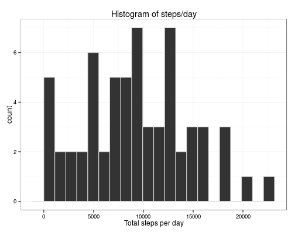
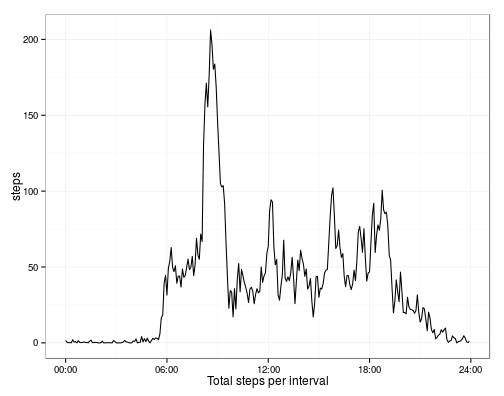
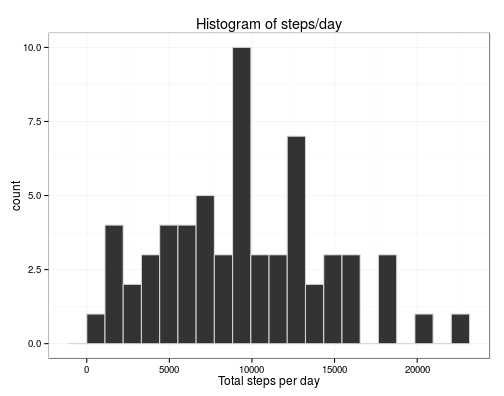
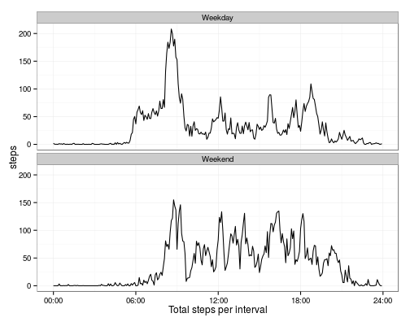

# Reproducible Research: Peer Assessment 1

Stephen Wade

9 August 2015


## Loading and preprocessing the data
The data is contained in an archive which must be extracted and loaded into R.


```r
library(knitr)
opts_chunk$set(fig.width=7, fig.height=5.5, fig.align='center')

if(!dir.exists('./data')) dir.create('./data')

unzip('activity.zip', exdir='./data/')

activity_data <- read.csv('./data/activity.csv')

str(activity_data)
```

```
## 'data.frame':	17568 obs. of  3 variables:
##  $ steps   : int  NA NA NA NA NA NA NA NA NA NA ...
##  $ date    : Factor w/ 61 levels "2012-10-01","2012-10-02",..: 1 1 1 1 1 1 1 1 1 1 ...
##  $ interval: int  0 5 10 15 20 25 30 35 40 45 ...
```

At this stage there is some missing data which is not treated and the analysis
is performed by simply ignoring missing values.

The date variable is more useful when stored as class `date`, while a weekday
column is added to the data frame. The interval is stored in a strange numeric
format, and so this is converted into a `posixct` format, using todays date as
a dummy.


```r
library(lubridate)
library(dplyr)
activity_data$date <- as.POSIXct(activity_data$date) +
                          (floor(activity_data$interval / 100) * 3600) +
                          ((activity_data$interval %% 100) * 60)
activity_data <- select(activity_data, steps, date, interval) %>%
                 mutate(weekday = weekdays(activity_data$date))
```


## What is mean total number of steps taken per day?

A histogram of the total number of steps taken per day is given below.


```r
library(ggplot2)

ad_total <- group_by(activity_data, date=as.Date(date)) %>%
            summarize(steps=sum(steps, na.rm=TRUE))

g <- ggplot(data=ad_total, aes(steps))
g + geom_histogram(binwidth=range(ad_total$steps)[2]/20,
                   color='light grey') +
    xlab('Total steps per day') +
    ggtitle('Histogram of steps/day') +
    theme(axis.title.y=element_blank()) + theme_bw()
```



```r
a <- summary(ad_total$steps)
```

The mean total number of steps per day is 9203 and the median is
8978

## What is the average daily activity pattern?

A time series is given below showing the average daily activity pattern by time
interval.


```r
ad_total <- group_by(activity_data, minute=hour(date)*60+minute(date)) %>%
            summarize(steps=mean(steps, na.rm=TRUE))

g <- ggplot(data=ad_total, aes(x=minute, y=steps))
g + geom_line() +
    xlab('Total steps per interval') +
    theme(axis.title.y=element_blank()) + theme_bw() +
    scale_x_continuous(labels = function(time) sprintf('%02d:%02d', 
                                            floor(time/60),
                                            time%%60),
                       breaks=c(0,360,720,1080,1440))
```



```r
max_interval <- ad_total$minute[which(ad_total$steps == max(ad_total$steps))]
max_interval <- sprintf('%02d:%02d',
                        floor(max_interval/60), 
                        max_interval%%60)
```

The interval which contains the maximum number of steps is the five minute
interval starting at 08:35.

## Imputing missing values


```r
missing_rate <- apply(is.na(activity_data), 2, mean)
missing_count <- apply(is.na(activity_data), 2, sum)
```

There are 2304 missing values of the steps variable.
The rate of missing data for the steps variable is then
0.1311475. This is addressed by imputing the median value of the not-N/A values of the interval/weekday pair.


```r
ad_medians <- group_by(activity_data, 
                       weekday,
                       interval) %>%
              summarise(msteps=median(as.numeric(steps), na.rm=TRUE))
na_rows <- filter(activity_data, is.na(steps)==TRUE) %>%
           left_join(ad_medians,
                     by=c('weekday', 'interval')) %>%
           mutate(steps = msteps) %>%
           select(steps,
                  date,
                  weekday,
                  interval)
activity_clean <- activity_data
activity_clean$steps[is.na(activity_clean$steps)] <- na_rows$steps

missing_rate_clean <- apply(is.na(activity_clean), 2, mean)

print(missing_rate_clean)
```

```
##    steps     date interval  weekday 
##        0        0        0        0
```
There is now no missing data, it has been imputed.

A histogram of the steps per day activity is produced using the clean data,
shown below.


```r
ad_total <- group_by(activity_clean, date=as.Date(date)) %>%
            summarize(steps=sum(steps, na.rm=TRUE))

g <- ggplot(data=ad_total, aes(steps))
g + geom_histogram(binwidth=range(ad_total$steps)[2]/20,
                   color='light grey') +
    xlab('Total steps per day') +
    ggtitle('Histogram of steps/day') +
    theme(axis.title.y=element_blank()) + theme_bw()
```



```r
b <- summary(ad_total$steps)
```

The mean of the clean data is 9549 with a median of 9394.
This demonstrates that with imputed missing data, the median and mean both
increase compared to the values obtained with the missing data being ignored.

## Are there differences in activity patterns between weekdays and weekends?

Time series are given below using the clean data by separating days into two
categories; weekdays and weekends. It is clear that on weekdays the pattern
of activity is slightly diminished from about 9am onwards, whereas the 
activity signal stays stronger throughout the day on weekends. Additionally,
the peak in activity at 08:35 is much more pronounced
on weekdays than on weekends.


```r
activity_clean <- mutate(activity_clean,
                         daytype = factor(ifelse(weekday %in% c('Saturday',
                                                                'Sunday'),
                                                 'Weekend',
                                                 'Weekday')))
ad_total <- group_by(activity_clean, daytype, minute=hour(date)*60+minute(date)) %>%
            summarize(steps=mean(steps, na.rm=TRUE))

g <- ggplot(data=ad_total, aes(x=minute, y=steps, group=daytype))
g + geom_line() +
    xlab('Total steps per interval') +
    facet_wrap(~daytype, nrow=2) +
    theme(axis.title.y=element_blank()) + theme_bw() +
    scale_x_continuous(labels = function(time) sprintf('%02d:%02d', 
                                            floor(time/60),
                                            time%%60),
                       breaks=c(0,360,720,1080,1440))
```


